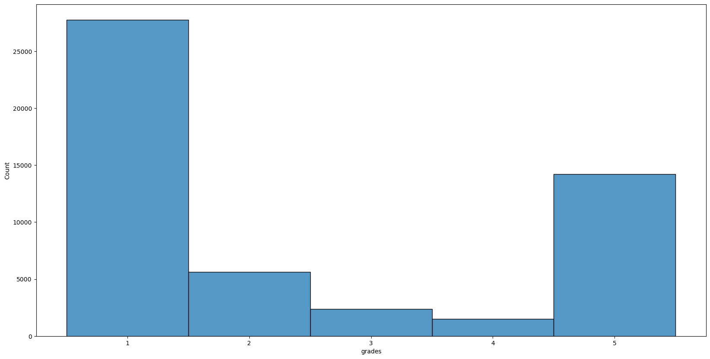
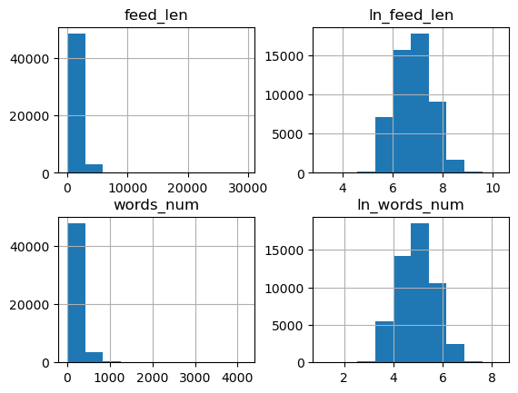
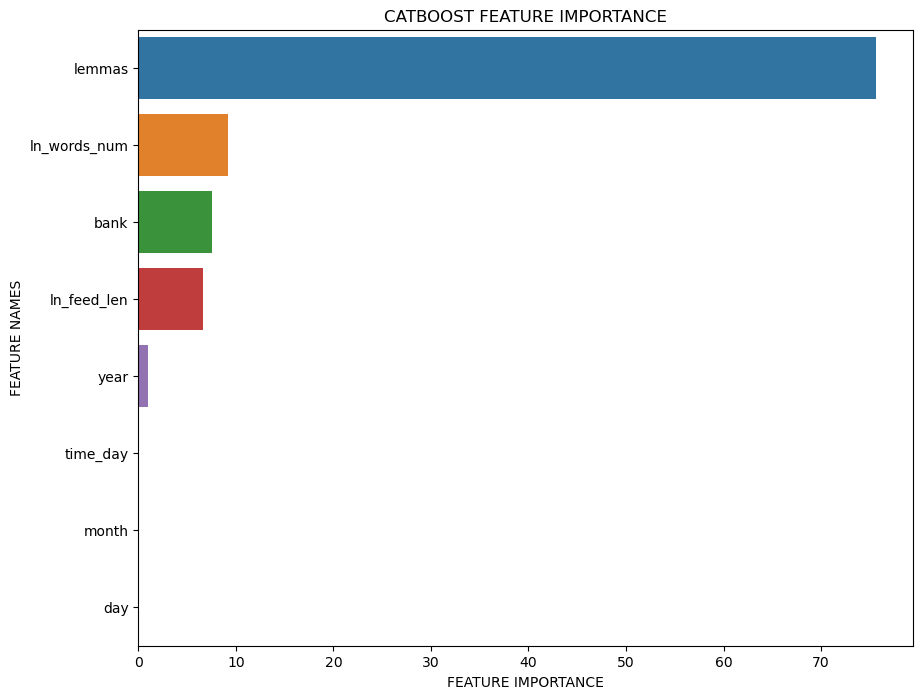

# first_step_in_nlp
- проект с использованием NLP для классификации отзывов с сайта Банки.ру
- был выполнен в рамках интенсива **First step in NLP** от НИУ ВШЭ (соревнование на Kaggle: https://www.kaggle.com/competitions/hse-nlp-bootcamp)

### Структура репозитория:
- файл feeds_sentiment_analysis.ipynb содержит в себе обработку данных, первичный анализ взаимосвязей и затем построение моделей, подбор гиперпараметров для них и выбор лучшей модели на основе величины целевой и других метрик

**папка data содержит:**
- архив zip отдельно с данными для обучения модели и для тестирования качества предсказаний на Kaggle
- файл с предсказаниями модели, показавшей лучшее качество (целевая метрика f1-score составила 0.7986 на private и 0.79605 на public данных)

### Описание данных
`bank` - название банка, для которого был написан отзыв  
`feeds` - текст отзыва  
`grades` - выставленная оценка (от 1 до 5)  
`date` - дата написания отзыва в формате dd.MM.yyyy HH:mm  

### Что было сделано в ходе проекта
- В первую очередь были созданы новые переменные **1) на основе даты:** `год`, `месяц`, `день`, `время суток` написания отзыва. **2) на основе текста отзыва:**  `длина текста в символах` и `количество слов в тексте`
- Далее были удалены пропуски в данных, так как в основном они были в переменной оценки (и их заполнение могло привести к лишнему шуму в процессе обучения моделей)
- Затем были построены распределения для различных признаков и выявлено, что **1)** большая часть выставленных оценок - это 1 и 5, то есть средние оценки ставятся сильно реже, что может привести к плохой обученности моделей выдавать эти оценки в своих предсказаниях 

 

- **2)** распределения новых переменных длины текста имеют длинные хвосты, в связи с чем они были приведены к нормальному распределению с помощью логарифмирования

- Были проведены попытки обработки текста (приведение к нижнему регистру, удаление знаков пунктуации, токенизация и лемматизация), однако далее выяснилось, что практически любая предварительная обработка текста приводит к ухудшению качества предсказаний моделей (**f1-score около 0.74 с обработкой текста и использованием catboost**)
- Были построены различные модели машинного обучения, гиперпараметры подбирались с помощью optuna, далее сравнивались величины различных метрик для этих моделей и выбиралась лучшая из них (в коде оставила две основные модели для примера, так как выбор модели был слишком объемный по длине кода)

### Итоги
- Как и предполагалось, большая часть моделей плохо предсказывает или почти не предсказывает оценки 2-4, так как они мало представлены в обучающей выборке
- Наиболее значимыми признаками для моделей оказались **1)** сам текст отзыва **2)** длина текста отзыва (и в словах, и в символах) **3)** название банка **4)** год написания отзыва. Это логично, так как **1)** очень плохие отзывы часто содержат более подробное описание ситуации, чем очень хорошие, поэтому они длиннее **2)** Чаще множество людей сталкивается с одной и той же проблемой в конкретном банке и пишет плохие отзывы, поэтому название банка важно **3)** Характеристики даты и времени написания отзыва не так сильно влияют (не считая года), так как люди пишут отзыв в свободное время и конкретно время написания отзыва вряд ли будет сильно связано с выставленной оценкой, а вот год или месяц могут быть связаны, так как за год упомянутые в отзывах проблемы уже более вероятно могут быть решены

- Тексты отзывов часто содержат в себе иронию, что мешает моделям корректно предсказывать выставленную оценку. Также предполагается, что именно в наличии иронии причина негативного влияния предварительной обработки текста на качество предсказаний  
**пример:**  отзыв  

"Отвратительно. Пытался заполнить платежное поручение в Сбербанк Онлайн для отправки платежа Юр Лицу на счет также в Сбербанке. Не получилось. Позвонил в центр обслуживания. Мало того, что 1й раз меня скинули, так еще и рассказали, что через Онлайн систему можно отправлять не все платежи (даже не смотря на то, что это внутрибанковский перевод). Так что идите и стойте в очереди в отделении. Очень удобно. Спасибо."  

сочетает в себе слова и "отвратительно", и "очень удобно", "спасибо". Человеку понятно, что отзыв негативный (просто по описанию ситуации) и что слова про удобство это ирония, а моделям машинного обучения это понять уже тяжело, тем более что явно позитивных слов даже больше, чем явно негативных.

- Лучше всего себя показало сочетание необработанного текста, векторизованного с помощью метода tf-idf, и модели SVM (kernel= sigmoid, C = 0.99) - **f1-score 0.7986**
- Возможно, использование нейросетей позволило бы достичь более высокого качества
